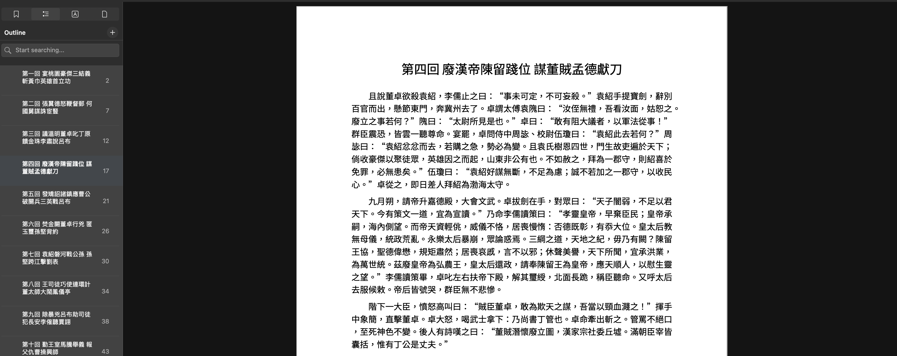

# HanwenPDF (漢PDF)

**HanwenPDF** is a specialized Python utility designed to transform Simplified Chinese text files into elegant, Traditional Chinese PDF documents. It is optimized for reading on Apple Books, featuring automatic chapter detection, sidebar navigation (bookmarks), and professional typography.
```zsh
./convert_s2t.py "books/sample_治安策.txt" --output="output/"
```
-----

## ✨ Key Features
* **Auto-Conversion:** Automatically converts Simplified Chinese (SC) to Traditional Chinese (TC) using [OpenCC](https://pypi.org/project/OpenCC/). Default conversion mode is `s2ctw`. `s2c` mode may cause variants (`爲`) to display incorrectly.
* **Smart Layout:** Detects chapter patterns (e.g., "第一回" or "第1回") to create page breaks and sidebar bookmarks.
* **Pro Typography:** Uses CJK-aware word wrapping and professional leading (line spacing).
* **Pagination:** Custom footer logic for "Page X of Y" numbering (skipping the title page).
* **Apple Books Ready:** Generates an internal PDF Outline for instant navigation.

-----

## 📂 Project Structure
```text
HanwenPDF/
├── convert_s2t.py      # The main executable script
├── fonts/              # Store your .ttc or .ttf fonts here
├── books/              # Place your source .txt files here
└── output/             # Generated PDF files
```
Books are forked from [tennessine/corpus](https://github.com/tennessine/corpus).

##  🚀 Getting Started
###  Prerequisites

Ensure you have Python 3.12+ installed. It is recommended to use a virtual environment:

```Bash
python3 -m venv my_env
source my_env/bin/activate
```
### Install Dependencies

```Bash
pip install reportlab OpenCC
```
### Font Setup

Place a Chinese-compatible font (like `NotoSansTC` or `NotoSansCJK.ttf`) into the `fonts/` folder.

### Permissions

Make the script executable:

```Bash
chmod +x convert_s2t.py
```
-----

##  Usage
Run the script by providing the path to your text file:

```Bash
./convert_s2t.py books/三国演义.txt -o output/
```

## 📸 Preview


## 🛠 Configuration
You can customize font sizes, margins, and chapter detection patterns by editing the `PDFConfig` class and `chapter_pattern` regex inside `convert_s2t.py`.

### Default Configuration
- **Conversion Mode:** `s2twp` (Simplified to Traditional-Taiwain)
- **Margins:** 72pt (1 inch) on all sides.
- **Font:** Noto Sans TC (placed in `/fonts`)

## ❓ Troubleshooting

### Character "Tofu" (Boxes)
- Font Path: Verify `fonts/NotoSansTC-Regular.ttf` is correctly placed.

- Glyph Support: Some fonts, inlcuding `NotoSansTC` support `為` but lack literary variants like `爲`. For maximum compatibility, use a `Full TrueType (TTF)` font.

- macOS Users: You can use the system font `/System/Library/Fonts/STHeiti Light.ttc` for excellent coverage.

### Command Not Found
If running `./convert_s2t.py` fails, ensure you have granted execution permissions:

```bash
chmod +x convert_s2t.py
```
## LICENSE
Licensed under the [MIT License](./LICENSE).

Note: Noto Sans is licensed under the [SIL Open Font License](https://scripts.sil.org/OFL).

Version: 1.0